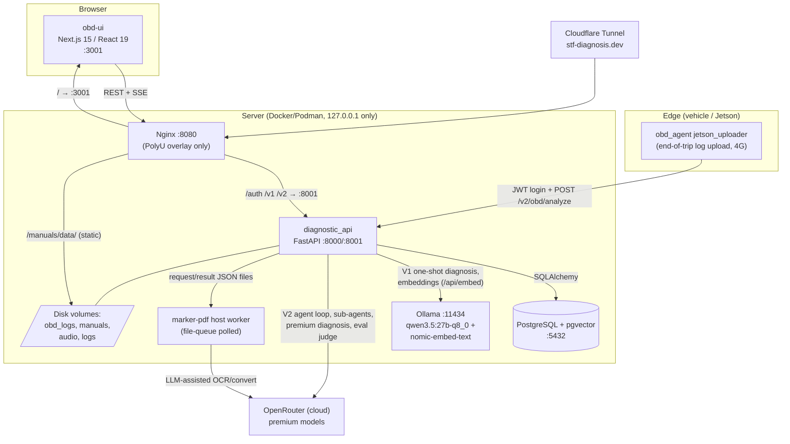

# STF AI Diagnosis Platform — Architecture Overview

> Senior-architect codebase analysis. Generated 2026-06-09 against `main`
> (`fb59a41`); updated the same day for the APP-53 cleanup (`67ca3a0`,
> PR #126). Companion documents: [docs/design_doc.md](docs/design_doc.md)
> (V1, APP-XX tickets) and [docs/v2_design_doc.md](docs/v2_design_doc.md)
> (V2 agent harness, HARNESS-XX tickets).

## 1. What This System Is

A Phase-1, local-first pilot for AI-assisted vehicle diagnosis. A rider or
technician uploads an OBD-II trip log; a deterministic preprocessing pipeline
reduces it to statistics, anomaly events, and rule-based diagnostic clues;
then one of three LLM-backed diagnosis providers turns that evidence (plus
retrieved service-manual context) into a technician-grade diagnosis. The
platform also hosts the supporting machinery: PDF service-manual ingestion
into a RAG store, a golden Q&A evaluation dashboard for workshop experts,
multi-channel feedback capture (ratings, comments, voice recordings), and
full audit trails of every generation.

Two architectural generations coexist deliberately:

- **V1 — context engineering**: one-shot LLM call with a pre-assembled
  prompt (parsed summary + top-k RAG snippets).
- **V2 — harness engineering**: a ReAct agent loop that iteratively calls
  tools (raw signal reads, DTC lookup, manual navigation) and can delegate
  to two specialist sub-agents. A graduated-autonomy router decides per
  request which generation handles the case.

## 2. High-Level System Architecture

### 2.1 Component diagram



In local development there is no Nginx: the UI on `:3001` talks to the API
on `:8000` directly (`NEXT_PUBLIC_API_URL`). The Nginx reverse proxy,
host networking, port 8001, and the Cloudflare tunnel are part of the PolyU
GPU-server overlay ([infra/docker-compose.polyu.yml](infra/docker-compose.polyu.yml)).

### 2.2 The five runtime components

| Component | Technology | Role |
|---|---|---|
| `diagnostic_api` | FastAPI + Pydantic + SQLAlchemy | All business logic: auth, OBD analysis pipeline, three diagnosis providers, RAG, manuals, goldens, feedback. |
| `postgres` | `pgvector/pgvector:0.7.4-pg15` | 13 ORM-managed tables incl. `rag_chunks` (768-dim HNSW vector index + tsvector). Schema owned by Alembic (34 migrations). |
| `ollama` | Local GPU inference | V1 one-shot diagnosis (`qwen3.5:27b-q8_0`), Tier-0/fallback path, and all embeddings (`nomic-embed-text`). |
| `obd-ui` | Next.js 15 / React 19 / Tailwind / i18next | Analysis tabs, live agent visualization (tool-call cards, reasoning panel, iteration progress), manuals, goldens review, EN/zh-CN/zh-TW. |
| `obd_agent` | Standalone Python package | OBD-II analysis library (normalize/stats/anomaly/clues) + `jetson_uploader` end-of-trip upload client; pip-installed into the API image. The live ELM327 acquisition loop was removed under APP-53 cleanup (PR #126, 2026-06-09). |

Plus two out-of-process collaborators: the **marker-pdf host worker**
(`scripts/marker_worker.py`, GPU-serialized, communicates via JSON files in
`/app/data/manuals/.queue/`) and **OpenRouter** for every cloud-LLM call.

### 2.3 API surface (routers mounted in [main.py](diagnostic_api/app/main.py))

| Prefix | Module | Highlights |
|---|---|---|
| `/auth` | `app/auth/router.py` | `register`, `login` (JWT; bcrypt via passlib). |
| `/v1/rag` | `app/api/v1/endpoints/rag.py` | `POST /retrieve` — vector / keyword / hybrid retrieval (default `vector`). |
| `/v2/tools` | `.../log_summary.py` | `POST /summarize-log-raw` — stateless run of the deterministic pipeline. |
| `/v2/obd` | `.../obd_analysis.py` | `POST /analyze` (upload), sessions list/detail, `POST /{id}/diagnose` (local SSE), feedback ×5 types, audio upload/playback, history. |
| `/v2/obd` | `.../obd_premium.py` | `GET /premium/models`, `POST /{id}/diagnose/premium` (SSE with 403-fallback model queue). |
| `/v2/obd` | `app/harness/router.py` | `POST /{id}/diagnose/agent` — V2 agent SSE stream. |
| `/v2/manuals` | `.../manuals.py` | Upload PDF (SHA-256 dedup), status polling, `reingest`, delete. |
| `/v2/goldens` | `.../goldens.py` | Golden entry list/detail, `POST /{id}/review` (append-only), team reviews, review audio, OBD reference-stats sidecar. |

All `/v2/obd`, `/v2/manuals`, and `/v2/goldens` endpoints require
`get_current_user` (JWT); session access is owner-scoped with
404-on-foreign-session to prevent enumeration. Exception: the stateless
`POST /v2/tools/summarize-log-raw` endpoint has **no auth dependency**
(see §5, low-impact list).

### 2.4 Database schema (13 tables, Alembic-managed)

`users` · `obd_analysis_sessions` (result JSONB + parsed summary + raw-log
path, unique `(user_id, input_text_hash)`) · `diagnosis_history` (immutable,
`provider ∈ {local, premium, agent}`) · five `obd_*_feedback` tables
(summary / detailed / rag / ai_diagnosis / premium_diagnosis, each with
optional audio columns) · `harness_event_log` (append-only agent audit
trail) · `manuals` (status machine: `uploading → converting → chunking →
embedding → ingested | failed`) · `golden_entries` + `golden_reviews` ·
`rag_chunks` (text, `Vector(768)`, HNSW `m=16, ef_construction=64`,
computed English tsvector, checksum dedup, FK→manuals cascade).

## 3. How Data Moves Through the System

### 3.1 OBD log → analysis session

```
 Jetson logger (collaborator OBU) — trip CSV/TSV accumulated on disk
                 │
                 ▼
   jetson_uploader: JWT login → POST /v2/obd/analyze   (≤10 MB raw body, 4G)
                 │
                 ▼
 diagnostic_api: dedup by sha256(body)+user_id ──▶ existing session? return it
                 │
                 ▼  asyncio.to_thread (blocking pipeline)
 ┌──────────────────────────────────────────────────────────────────┐
 │ Deterministic pipeline (obd_agent modules, NO LLM):              │
 │  0. log_summarizer        legacy PID summary (heuristics)        │
 │  1. format_normalizer     OBDWIZ/obd_maxlog/Yamaha CSV → TSV     │
 │  2. time_series_normalizer  1 Hz resample, 32 semantic columns   │
 │  3. statistics_extractor  15 stats per signal        (APP-14)    │
 │  4. anomaly_detector      ruptures.Pelt + IsolationForest        │
 │  5. clue_generator        25 YAML rules → clues      (APP-16)    │
 └──────────────────────────────────────────────────────────────────┘
                 │
                 ▼
   obd_analysis_sessions row:  result_payload (LogSummaryV2 JSONB)
                               parsed_summary_payload (flat strings for LLM)
                               raw log persisted to /app/data/obd_logs/
                 │
                 ▼
   session_id → UI redirects to /analysis/{session_id}
```

Only the *derived* summary ever reaches an LLM; raw waveforms stay in the
backend (project privacy boundary).

### 3.2 Diagnosis — three providers, one funnel

```
POST /v2/obd/{id}/diagnose/agent
        │
        ▼
 autonomy.classify_complexity(parsed_summary)      [deterministic Tier 0–3]
        │
   Tier 0 ──────────────────────────────┐
        │ Tier 1–3 (or force_agent)     │
        ▼                               ▼
 V2 AGENT LOOP (OpenRouter)        V1 ONE-SHOT (Ollama)
 harness/loop.py                   also: POST /v2/obd/{id}/diagnose
 ┌────────────────────────┐        ┌─────────────────────────────┐
 │ system+user prompt     │        │ retrieve_context(top_k=3,   │
 │ ┌──────────────────┐   │        │   mode='vector') → snippets │
 │ │ LLM stream       │◀──┼─┐      │ ExpertLLMClient stream      │
 │ │ (reasoning+text) │   │ │      │ (qwen3.5:27b, temp 0.3)     │
 │ └────────┬─────────┘   │ │      └─────────────────────────────┘
 │   tool_calls?          │ │
 │     ├─ no → done       │ │      PREMIUM (OpenRouter)
 │     └─ yes:            │ │      POST /v2/obd/{id}/diagnose/premium
 │  registry.execute()    │ │      same retrieval; model-fallback
 │  11 tools: 6 OBD,      │ │      queue on 403 (region blocks)
 │  3 manual, 2 delegate  │ │
 │  truncate (2k tokens)  │ │
 │  compact at 60k tokens │─┘ loop ≤500 iters, ≤1200 s
 └────────────────────────┘
        │ every step → harness_event_log (append-only)
        ▼
 SSE to browser: session_start | reasoning | token | tool_call |
   tool_result | hypothesis | context_compact | diagnosis_done | done | error
        │
        ▼
 diagnosis_history row (provider='agent'|'local'|'premium', immutable)
 + session.diagnosis_text / premium_diagnosis_text (latest, quick access)
```

Sub-agent delegation: `delegate_to_obd_agent` (6 OBD tools, 240 s
wall-clock, ≤8 iterations) and `delegate_to_manual_agent` (3 manual tools,
120 s) run restricted ReAct loops on the same premium endpoint and return
structured, citation-bearing results formatted to markdown for the main
agent. Sub-agents carry no delegation tools, so recursion is impossible.

Notable asymmetry: V2 agent tools re-parse the **raw** uploaded log
(`harness_tools/obd_loader.py`), preserving Yamaha-proprietary `A_YAM_*`
channels that the V1 normalizer drops — the agent intentionally sees more
data than the Summary tab (HARNESS-19).

### 3.3 Service manual → RAG store

```
POST /v2/manuals/upload (PDF, ≤200 MB default cap, sha-256 dedup)
   │ Manual{status=converting}; PDF → /app/data/manuals/uploads/
   ▼
write {manual_id}.request.json → .queue/ ──▶ marker-pdf HOST WORKER
   │   (API polls result/progress JSON; status synced to DB)   │
   │                    LLM-assisted conversion (OpenRouter) ◀─┘
   ▼
markdown + images → chunker (500 chars / 50 overlap, CJK-aware,
image markers kept atomic) → nomic-embed-text via Ollama /api/embed
   ▼
rag_chunks rows (768-dim vector, tsvector, checksum-idempotent)
Manual{status=ingested}
   ▼
Consumers: /v1/rag/retrieve · V1 diagnose retrieval · agent manual tools
(read .md directly) · Nginx-served static viewer at /manuals/data/
```

### 3.4 Golden evaluation loop (offline → online)

`scripts/generate_golden_candidates.py` → human review → `promote_golden.py`
→ locked JSONL (`tests/harness/evals/golden/v2/locked/`) → synced to
`golden_entries` at every API boot (`golden_sync`) → workshop experts grade
entries in the UI (`golden_reviews`, append-only, with audio) → eval harness
(`tests/harness/evals/`, LLM-judge via OpenRouter) benchmarks agent vs RAG.

## 4. Key Directories

| Path | Responsibility |
|---|---|
| [diagnostic_api/app/main.py](diagnostic_api/app/main.py) | App assembly, lifespan startup gates (JWT secret, premium key, Alembic state guardrail, golden sync, orphan cleanup). |
| [diagnostic_api/app/api/](diagnostic_api/app/api/) | HTTP layer. `v2/endpoints/obd_analysis.py` is the largest module: sessions, local diagnosis, feedback, audio — and a de-facto shared helper library (see §5). |
| [diagnostic_api/app/harness/](diagnostic_api/app/harness/) | V2 agent core: ReAct `loop.py`, SSE `router.py`, token budget + compaction (`context.py`), `tool_registry.py`, graduated `autonomy.py`, append-only `session_log.py`. |
| [diagnostic_api/app/harness_tools/](diagnostic_api/app/harness_tools/) | The 11 agent tools: OBD signal primitives, DTC lookup, manual navigation (`manual_fs.py` does the markdown parsing), delegation wrappers, Pydantic input models. |
| [diagnostic_api/app/harness_agents/](diagnostic_api/app/harness_agents/) | OBD and manual specialist sub-agents + result types/formatters. |
| [diagnostic_api/app/rag/](diagnostic_api/app/rag/) | Ingestion (`parser`, `chunker`, `embedding`, `ingest`) and retrieval (`retrieve.py`: vector / keyword / hybrid). |
| [diagnostic_api/app/expert/](diagnostic_api/app/expert/) | LLM clients: `client.py` (Ollama, V1), `premium_client.py` (OpenRouter), prompts, model-availability cache. |
| [diagnostic_api/app/auth/](diagnostic_api/app/auth/), [app/db/](diagnostic_api/app/db/), [app/services/](diagnostic_api/app/services/) | JWT auth; engine/session factory; startup services (`alembic_check`, `golden_sync`, `manual_pipeline`). |
| [diagnostic_api/alembic/](diagnostic_api/alembic/) | 34 migrations, single head. Migrations do **not** auto-run on container start — deploy procedure applies them explicitly. |
| [diagnostic_api/scripts/](diagnostic_api/scripts/) | Operational tooling: golden lifecycle scripts, `marker_worker.py`, `export_anonymised_corpus.py` (the **mandatory** VIN-pseudonymisation egress gate under APP-54). |
| [diagnostic_api/tests/](diagnostic_api/tests/) | pytest suite **plus** the golden corpus + eval harness under `tests/harness/evals/` — parts of which are runtime dependencies (§5). |
| [obd_agent/](obd_agent/) | The deterministic analysis library (normalizers, statistics, anomaly detection, clue rules) plus the `jetson_uploader` upload client. Installed into the API image; the acquisition loop (readers / snapshot transport) was removed under APP-53 cleanup. |
| [obd-ui/](obd-ui/) | Next.js frontend. `src/lib/api.ts` is the single REST+SSE client; `src/components/` holds the agent-visualization suite. |
| [infra/](infra/) | Compose files (base = 4 services; PolyU overlay adds Nginx/host networking/GPU), Nginx config + static manual viewer, Postgres init scripts, Makefile, smoke tests. |
| [docs/](docs/) | Governed doc sets (V1 + V2 design/dev plans with a mandatory pre-commit update gate), schema docs, baselines, reports. |

Housekeeping note: top-level `diagnostic_api;C/`, `obd_agent;C/`,
`steam-test/`, and `scripts/` are empty, untracked local artifacts (the
`;C` names look like a mangled Windows command) and can be deleted.

## 5. Architectural Issues & Recommendations

### High impact

**1. "Local-first" is no longer true for the headline features.**
The V2 agent loop, both sub-agents, marker-pdf manual conversion, premium
diagnosis, and the eval judge all run on OpenRouter
(`harness/router.py`, `delegation_tools.py`), and the API **refuses to
boot** without `PREMIUM_LLM_API_KEY` (`main.py` lifespan). Only V1 one-shot
and embeddings are local. This is a single external point of failure, a
recurring cost, and a quiet contradiction of the privacy posture (summaries
now leave the machine routinely).
*Recommendation:* make the LLM backend per-feature configurable behind the
existing `LLMClient` protocol; degrade gracefully (disable manual upload,
fall back agent→local) when the key is absent; document which data classes
may transit OpenRouter.

**2. `obd_analysis.py` is a load-bearing god-module.**
~1,700 lines serving as endpoint module *and* shared library:
`harness/router.py` and `obd_premium.py` import its private helpers
(`_get_session_data`, `_sse_event`, `_store_diagnosis`,
`_submit_feedback`). All three diagnosis providers funnel through these
underscore-private functions, so any edit ripples across V1 and V2 at once.
*Recommendation:* extract a `app/services/diagnosis_store.py` (and
`sse.py`) with a public, typed interface; leave endpoints thin.

**3. Two parsers and two statistics engines can disagree about the same
log.** The V1 pipeline normalizes (dropping `A_YAM_*` channels) and computes
stats in `obd_agent/statistics_extractor.py` (pandas); the V2 agent
re-parses raw bytes and computes stats in `harness_tools/obd_signals.py`
(pure Python, different percentile interpolation and variance convention).
The Summary tab and the agent can therefore show different numbers for the
same signal — corrosive to user trust and impossible to regression-test.
*Recommendation:* single shared stats core (one implementation, two
front-ends); add a golden test asserting V1/V2 parity on a fixture log.
Also stop importing private symbols (`_PID_UNITS`, `_parse_dtc_list`) from
`obd_agent.log_parser` across the package boundary — promote them to a
public API.

**4. No backpressure anywhere on the expensive paths.**
`/v2/obd/analyze` runs a blocking pandas/sklearn pipeline in the default
thread pool; the agent endpoint can run 500 iterations for 20 minutes per
request with no per-user concurrency cap, token budget, or cost meter;
nothing throttles concurrent Ollama/OpenRouter calls. A handful of users
can starve the box.
*Recommendation (scalability):* per-user concurrency + rate limits at
Nginx and app level; move the analysis pipeline and manual ingestion onto a
real work queue (e.g. arq/Celery + Redis, or Postgres `SKIP LOCKED` jobs to
stay dependency-light) so the API process only orchestrates; record
token/cost per `harness_event_log` session.

### Medium impact

**5. The test tree is a production dependency.** `golden_sync` reads
`tests/harness/evals/golden/v2/` at boot, `/v2/goldens/obd/reference-stats`
serves a fixture JSON from `tests/`, and the Dockerfile bakes those test
paths into the image. A tests-only refactor can break prod endpoints.
*Recommendation:* move the golden corpus to `diagnostic_api/data/golden/`
(versioned, shipped intentionally); tests and runtime both point there.

**6. Hybrid retrieval (APP-56) shipped as dead code.** Every production
caller uses `retrieve_context` defaults (`mode='vector'`): local diagnose,
premium, one-shot fallback, RAG feedback snapshot; `search_manual` was
removed from the main-agent registry in v1.6.0. Only the eval runner
exercises hybrid. Additionally the tsvector is hard-coded English while the
corpus is partly Chinese.
*Recommendation:* either flip the default to `hybrid` after an eval-gated
A/B on the golden set, or delete the mode and the maintenance burden.
Pass `vehicle_model` filters from session context into retrieval.

**7. Split schema ownership.** `infra/init-scripts/01-init-databases.sh`
still creates legacy `interaction_logs`/`diagnostic_sessions` tables that
have no ORM model (V1 tables were dropped by migration), so fresh deploys
get dead tables; the real schema is Alembic's. Migrations also don't run on
container start (deploy step applies them manually; the startup guardrail
only *detects* drift).
*Recommendation:* strip table creation from init scripts (keep extensions
+ roles only); add an explicit migration job/entrypoint gate to the deploy
composition.

**8. Single-process, single-disk state blocks horizontal scaling.**
In-memory model-availability cache, process-cached reference stats, file
queues on a local volume, audio/manuals/logs on node-local disk, SSE
affinity — all assume exactly one API replica.
*Recommendation:* when (and only when) multi-instance becomes a goal:
externalize caches to Postgres/Redis, move file artifacts to object
storage, and keep SSE streams resumable via `harness_event_log` replay
(the append-only log already makes this feasible — a good design choice).

### Low impact (worth scheduling)

- **`POST /v2/tools/summarize-log-raw` is unauthenticated** — it runs the
  full (CPU-bound) analysis pipeline with no `get_current_user` dependency,
  unlike every other v2 endpoint. Add the auth dependency or remove the
  endpoint if `/v2/obd/analyze` has superseded it.
- **Health checks are stubs** (`/health` hardcodes `database`/`llm` healthy,
  TODO(APP-29)) while Nginx and compose `service_healthy` gates rely on
  them — implement real probes.
- **`harness_event_log` and `diagnosis_history` grow unboundedly** (JSONB
  payloads per tool call); define retention/archival before pilot data
  accumulates.
- **Edge agent dead path — RESOLVED 2026-06-09:** the deprecated
  `APIPoster` snapshot transport (targeting the never-implemented
  `/v1/telemetry/obd_snapshot`) and the whole acquisition layer were
  removed in PR #126; `jetson_uploader` → `POST /v2/obd/analyze` is the
  sole ingestion path, and the GPL `python-obd` dependency is gone.
- **DB pool sized from the port number** (`pool_size = db_port if
  db_port < 20 else 20` in `app/db/session.py`) — replace with an explicit
  `DB_POOL_SIZE` setting.
- **No TLS inside the deployment** — acceptable while Cloudflare terminates
  at the tunnel and everything binds to 127.0.0.1, but document that the
  tunnel is the only safe ingress.
- **Four pytest files live in `infra/`** instead of `diagnostic_api/tests/`,
  violating the repo's own testing convention.
- **Manual conversion can hang forever** if the host worker dies
  (indefinite result-file polling; UI spins) — add a poll deadline that
  fails the manual with a actionable error.

### What's working well

The deterministic two-pass OBD reduction in front of the LLM, the strictly
append-only audit surfaces (`diagnosis_history`, `harness_event_log`,
golden reviews), checksum-idempotent RAG ingestion, the Alembic startup
guardrail born from a real incident (HARNESS-20), the graduated-autonomy
router that keeps cheap cases cheap, and the golden-corpus eval loop are
all genuinely solid foundations — the issues above are mostly about
consolidating duplicated paths and preparing the single-node design for
multi-user load, not about rearchitecting.
