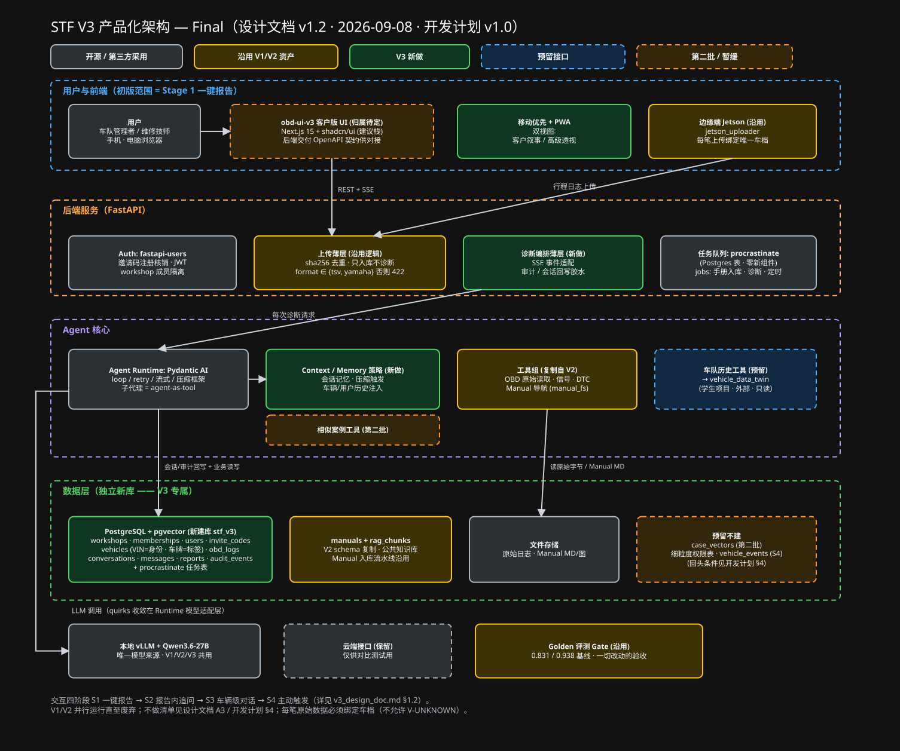

# STF V3 设计文档

| 文档控制 | |
|---|---|
| 版本 | **v1.10（PROD-08：Pydantic AI 运行时落地——12 个工具、两个子代理、10 种事件、预算闸门）** |
| 日期 | 2026-09-17 |
| 作者 | Xiangzhu Yan |
| 状态 | **已定稿** —— 开发计划 v1.1；代码设计蓝图 `docs/plans/2026-09-08-v3-code-design.md` v1.0 已通过（2026-09-11），M1 / PROD-02 开工 |

## 总架构图（本文档的第一视图，与正文强制同步）

- 可编辑源文件：[diagrams/stf_v3_final_architecture.excalidraw](diagrams/stf_v3_final_architecture.excalidraw)
  （excalidraw.com → 菜单 → Open 打开）
- 图例：灰 = 开源/第三方采用 · 黄 = 沿用 V1/V2 · 绿 = V3 新做 ·
  蓝虚线 = 预留接口 · 橙虚线 = 第二批/暂缓
- **同步规则（强制）**：任何改变架构口径的文档修订，必须在**同一次
  提交**中更新本图（.excalidraw + 预览 .svg 一起），并在变更记录中
  注明"图已同步"。图与正文不一致时，以最新版本号的正文为准并立即
  修图。此图是全局指挥视图——评审、发现问题、提需求都从看图开始。

## 1. 已确认决策（2026-08-31 Round 1，用户逐项拍板）

### 1.1 定位（A1/A2）

- V3 是**真正的产品形态**；V1/V2 是学习积累用的研究版本，**最终将被
  废弃**，后续全部工作都在 V3 上进行。
- 目标用户：**车队管理者 + 维修技师**（两者都是）。

### 1.2 交互模式（此前唯一定案，维持）

三原则：车辆是锚点（车队→车辆→会话→消息/报告/日志）；上传与诊断
解耦（上传只入库，诊断是车辆页显式动作）；会话是容器、报告是产物
（单轮也存为会话）。
四阶段：S1 一键报告 → S2 报告内追问 → S3 车辆级自由对话 →
S4 系统主动触发。

### 1.3 初版范围（B3）

**初版只交付 Stage 1**（车辆页 + 一键诊断报告，用户零自由输入）。

### 1.4 技术选型相关

- **Agent Runtime SDK（C1，已定 2026-09-01）**：**Pydantic AI**。
  经纸面深度对比（九维记分卡 + 业界案例 + 委托模式解答，见
  `.lavish/sdk_comparison.html`）后用户拍板。决定性理由：本地 vLLM
  默认下 OpenAI SDK 内建优势失效而 ModelProfile 专治 qwen 工具调用
  怪癖；TestModel 支撑 golden 门槛工程化；provider 无关设计锁定
  风险最低。LangGraph 判定为编排层框架，与我们"单 Agent 动态委托"
  档位不符（HARNESS-23：自主循环 0.670 vs 固定流程 0.239），
  留作远期 Stage 4 编排层选项。
- **前端（C2，已定 2026-09-01；归属变更 2026-09-08 · D6）**：技术栈
  **Next.js 15（App Router）+ TypeScript + Tailwind CSS v4 + shadcn/ui +
  TanStack Query**，移动优先响应式 + PWA（见
  `.lavish/frontend_recommendation.html`）。**归属待定**：PM 已将前端分配
  给一名学生，前端需求下周到位、实现归属下次会议再定。在此之前技术栈
  决定保留为建议，后端从 M1 起交付 OpenAPI 契约供任何一方对接，自测走
  Swagger + curl，不做临时前端。
- **Auth（C3 + C3b；选型已定 2026-09-08 · D4）**：**fastapi-users**
  （注册 / 登录 / JWT / 密码哈希开箱即用，同进程无新服务）；注册验证
  采用**邀请码制**（我们发码才能注册，pilot 期最可控、不依赖外网
  邮件服务），邀请码核销逻辑自加一层；用户按 workshop 成员关系隔离
  （见 §1.8）。
- **任务队列（C4；选型已定 2026-09-08 · D5）**：**procrastinate**
  （Postgres 上的任务队列：任务表就在 `stf_v3` 库里，零新组件，
  "建会话 + 投任务"同一事务）。模块名 `jobs`，装三类任务：手册入库
  （**一步到位**：MinerU 转换 → 建目录树与索引 → 章节摘要 → 八道
  质量门 → 全过才"已入库"，marker 与两段式在 V3 不再使用；由宿主机
  GPU worker 消费 `gpu` 队列、并发 1，替代 V2 的共享卷文件协议；
  PROD-06 决定 2026-09-14）、诊断运行（独立于 HTTP 连接跑完，
  支撑断线回放）、定时维护（stalled 任务回收已上线；audit 归档、
  孤儿文件清理、模型预热在 PROD-15）；将来 S4 主动触发也走它。
  宿主机 worker 跑的是**同一份 V3 代码**（用户级 `uv` 装 Python 3.11
  专属环境，编辑式安装），MinerU 是外部命令行工具、自带环境。选型理由与备选（Kafka / arq / Celery）
  的通俗对比见 2026-09-08 会话记录。
- **LLM 供给（C5；补充 2026-09-08 · D7）**：**唯一一个本地 vLLM 实例
  是模型来源**，V1/V2/V3 共用（vLLM 无状态、三版本不并发抢资源）；
  换模型统一换，换前分别用 V2 与 V3 的 golden 基准各跑一遍作门槛。
  V3 只通过配置指向该服务。云端保留一个接口，仅供对比测试用。
- **Agent 运行时落地（PROD-08，2026-09-17）**：主诊断 Agent + 手册 /
  OBD 两个子代理（各以工具形式挂载，用量计入主 Agent 总预算）；12 个
  工具（6 OBD + 4 手册 + 2 委托）只返回文本摘要；三种原始日志格式由
  `ingest/loader` 直读成同一形状（信号名与 V2 一致）；车辆信息来自
  车档（非本机模型时 VIN 假名化），手册编号 = 数据库编号；事件即
  蓝图 §3.7 的 10 个名字（`session_start / reasoning / token / tool_call /
  tool_result / hypothesis(预留) / context_compact / diagnosis_done /
  done / error`），子代理事件带父调用编号；四道预算闸门（墙钟 / 请求
  数 / 工具数 / 总 token）与取消都以"部分报告"收尾；报告 = 正文 +
  由工具轨迹证明的引用（正文里未读过的引用标 `NO_SOURCE`）；模型来源
  只有一个配置项，非本机地址须显式允许。**PROD-08 只交付程序库 +
  服务器真跑脚本**；诊断接口 / 队列任务 / SSE / 落库在 PROD-11，模型
  适配（thinking、vLLM）在 PROD-09，golden 门槛在 PROD-10。

### 1.5 组件取舍

- **确定性流水线（D1，Round 2）**：**整体移除，不做任何格式转换
  兼容**。V3 只接受 Agent 读取工具已支持的格式：Jetson 原生
  TSV + Yamaha 双通道 CSV，**以及真机记录脚本实际输出的 "OBD Maximum
  Data Log" CSV（PROD-07 D3，2026-09-17 针对性加入，原始字节照存）**。
  不保留 format_normalizer、不引入通用格式层——"没法测试的通用能力
  不要预建，真遇到新格式再针对性处理"（用户原则：不引入额外复杂度；
  maxlog 正是按这条处理的第一个实例）。
- **clue YAML 规则（D2）**：暂存，不进初版。
- **V2 工具（D3）**：**全部沿用，复制一份进 V3**（不抽共享包，
  放弃 V2/V3 同源——V1/V2 反正最终废弃，见 §1.1）。
- **相似案例功能（D4）**：**第二批**再做，不进初版。
- **车队历史系统接口（D5）**：等与学生（vehicle_data_twin）对齐
  API 形态后再写入文档。
- **V3 代码落位（开发计划 D3，2026-09-08）**：**同仓新目录**
  `stf_v3/`（后端）+ `obd-ui-v3/`（前端），附两条硬约束——
  **A 可迁出**：两目录各自自包含（依赖清单、Dockerfile、Alembic、
  测试、golden 数据副本、CI job），**禁止 import** `diagnostic_api/`、
  `obd_agent/` 的任何东西，只准复制；**B 不绑死**：与 V1/V2 只在
  基础设施层共享（同一 Postgres 实例的不同 database、同一 vLLM、
  同一 nginx），全部通过配置连接，代码里零引用；Compose 用独立文件
  `infra/docker-compose.v3.yml`。两条都有自动化验收（拷到空目录测试
  全绿；删掉老目录 V3 照常构建），写入开发计划 DoD。

### 1.6 数据与隐私

- **库的边界（E2，Round 2）**：**V3 新建独立数据库**。理由（用户）：
  V1/V2 将逐渐废弃、后续全部迭代在 V3 上，产品化之后再想迁移就难了
  ——V3 就是最好的迁移时机。V1/V2 库不动，随版本一起退役。
- **数据模型（E1）**：现在就起草（→ 待办：数据模型草案）。
- **隐私（E3）**：**暂不隐藏 VIN**；等整套工作流跑明白后，再在
  恰当的时机做 VIN 模糊处理。（注意：这延续了 APP-54 的口径，
  正式对外前需回头处理。）

### 1.7 质量与运维（F，Round 2）

- **Golden 评测继续作为验收门槛**（改动不掉分才算过）。
- **继续部署在 PolyU GPU 服务器**（Cloudflare 隧道对外）。
- **配额/限流不做**：用户量很小，真遇到问题再说。

### 1.8 数据模型（E1 交付物③，已确认 2026-09-01；v1.2 按开发计划 D1/D2/D8 修订）

独立新库 `stf_v3`（同一 Postgres 实例新建 database），Stage 1 共
10 张业务表 + procrastinate 任务表（v1.0 原 8 张见
`.lavish/data_model.html`；修订决策见 `.lavish/v3_dev_plan_decisions.html`）：

- `workshops`（**所有权主体** · D1）：车挂在 workshop 名下；pilot 期
  一个 workshop。第二个车队接入 = 加一行。
- `memberships(user_id, workshop_id, role)`（D1）：系统用户 = workshop
  成员；`role ∈ {manager, technician}`；成员可访问本 workshop **全部**
  车辆。**车主在 Stage 1 不是系统用户，不建模。**
- `users` / `invite_codes`（邀请码注册核销；fastapi-users 用户模型）
- `vehicles`（**锚点**；D2 修订）：`workshop_id` 必填；**`vin` = 身份，
  必填**，(workshop_id, vin) 唯一，建档时从行驶证 / 车架铭牌抄 17 位码；
  **`plate` = 可选标签**（只显示、可随时改、无唯一约束、不参与鉴权或
  匹配，为对接按车牌建档的 vehicle_data_twin 保留对应字段）；
  `manufacturer` / `model` 必填（诊断时凭它找手册）；`nickname` 可空；
  软删除。VIN 暂存明文（E3）。
- `obd_logs`（上传只入库；format ∈ {tsv, yamaha, maxlog}，其余 422；
  (vehicle_id, sha256) 唯一防重）。**数据归属不变量（D8）：
  `vehicle_id` NOT NULL，每一笔原始数据必须绑定唯一车档，任何转存 /
  导出 / 迁移以此外键为准；不允许 "V-UNKNOWN"。** 日志内读到 VIN 时
  与车档核对，**不一致直接拒收（422 `vin_mismatch`，不落盘不入库；
  决策 D2，2026-09-13，PROD-05）**——错车的数据永远进不了库；文件里
  读不到 VIN（Yamaha 常见）则不核对，归属仍由车档保证。设备如何表明
  "我是哪台车"见蓝图 §5（设备凭证）。原始字节存独立具名卷
  `stf_v3_obd_logs`，路径 `<vehicle_id>/<log_id>.<ext>`（目录名即车）。
  **设备侧（PROD-07）**：Jetson 上的上传脚本过渡期"双推"——先推 V2
  （原样），再凭设备 token 推 V3；V3 腿失败进设备本地待传目录、按退避
  补传，服务器按内容哈希去重使补传幂等；服务器拒收（413 / 422）不重试
  而进拒收目录并在服务器端留 `ingest.rejected` 结构化事件（设备日志
  我们看不到，这是唯一的服务器侧可见性）；token 被吊销（401）视为配置
  问题，文件留在待传目录。装机手册 `docs/v3_device_install.md`。
- `diagnosis_conversations`（**容器**；引用 vehicle + 本次依据的
  obd_log；S2 追问零迁移）
- `messages`（Pydantic AI 消息原样 JSONB 序列化）
- `reports`（会话的产物；content_md + citations）
- `audit_events`（append-only 黑匣子，事件名与 SSE 一致；继承 V2
  harness_event_log 经验；保留策略由 `jobs` 定时任务执行，PROD-15 落地）
- `manuals`（公共知识库的**元数据**：身份、入库状态、阶段进度；手册正文是磁盘上的
  Markdown 文件 + HARNESS-30 索引 sidecar，由 manual_fs / manual_index 直接读取，
  有索引走索引轨、没有退回标题树）。**Stage 1 不装 pgvector、不建
  `rag_chunks`、不做向量化**（决定 2026-09-11）：V2 的 Agent 路径从不读向量表，
  `rag_chunks` 只被已废弃的旧 RAG 工具与评测对照组使用；将来做相似案例时再用
  一条迁移加回扩展与表（开发计划 §4）。**PROD-06（2026-09-14）**：库是全车队
  共享的公共库（成员可读，manager 可上传 / 删除；从 V2 搬来的两本为 seed，接口不可
  删）；文件存独立具名卷 `stf_v3_manuals`，与 V2 目录结构一字不差；新手册只收 PDF
  （≤ 200 MB、≤ 800 页、不加密），按内容哈希去重；入库一步到位（见 §1.4）。
- procrastinate 任务表（D5；由库自带 schema 在初始迁移中创建）
- 预留不建：`case_vectors`（D4 第二批）、细粒度权限表、`vehicle_events`
  （S4 时事件先落表再投任务）。回头条件见开发计划 §4。

**诊断时的车辆信息用法（D8 要求）**：`manufacturer + model` → 找手册；
`vin` → 找历史维修记录（vehicle_data_twin）与历史原始数据（`obd_logs`）。

**机制层表与字段（PROD-01 蓝图 §4–§5，2026-09-11）**：`vehicle_devices`
（每台车的设备凭证，只存哈希；Jetson 装机时持有，上传即绑定车档）；
`obd_logs.source / device_id / vin_from_log / vin_mismatch`（来源与 VIN 核对结果）；
`diagnosis_conversations.job_id / cancel_requested`、`manuals.job_id`（队列关联）；
`invite_codes.workshop_id / role`（邀请码即入组）；`users.username`（登录名，
email 可空）。角色权限：technician 可做全部日常操作，manager 独占删车 / 发码 /
设备凭证 / 手册管理。完整 DDL 以蓝图 §4 为准。

**编码约定**：鉴权收敛为唯一函数 `can_access_vehicle()`，Stage 1 的
实现 = "当前用户是否为该车 workshop 的成员"；将来细粒度权限只改此一处。

### 1.9 流程（G，Round 3）

- **V3 ticket 前缀：`PROD-XX`**（对应 V1 的 APP-XX、V2 的
  HARNESS-XX）。
- 定稿标准（暂按建议执行，可随时改）：决策看板所有 🔴 项拍板完成
  ＋三个交付物（SDK 对比报告、前端推荐、数据模型草案）经用户确认
  ＝ 文档定稿，进入代码设计。

### 1.10 推进顺序（ORDER）

按建议顺序推进：A → B3 → D1/D3 → C1 → E → 其余。

### 1.11 非目标清单（A3，2026-09-08 · 开发计划 D9 补齐）

V3 第一版只做"点一下出诊断报告"。以下**明确不做**；每一项的
"什么条件出现时回头做"记录在 `docs/v3_dev_plan.md` §4，每个里程碑
结束时复查：

| 不做什么 | 说明 |
|---|---|
| 报告内追问、车辆级自由对话、系统主动触发 | Stage 2–4，第一版不能对话 |
| 车队病历接入（vehicle_data_twin）、车队总览 Dashboard、相似案例 | 底座之上的下一批 |
| 实时遥测 / 时序数据库 | 只收行程结束后的日志文件 |
| 通用日志格式转换层 | 只认 Jetson TSV + Yamaha CSV + OBD Maximum CSV（PROD-07 针对性加），新格式针对性加 |
| 细粒度权限 | workshop 成员看本 workshop 全部车 |
| 微服务 / 消息总线 / Kubernetes | 一个后端进程 + 一个 worker |
| 配额 / 限流 | 用户几十个 |
| VIN 模糊化 | 明文存；正式对外前再做 |
| 模型微调 / LoRA | 只用现成 Qwen |
| V1/V2 用户数据迁移 | 新库从零开始 |
| 前端语言 / 样式等需求 | 前端归属未定（D6），不在本文档定 |

## 2. 开放项

| # | 问题 | 状态 |
|---|---|---|
| A3 | 非目标清单 | ✅ 已补（§1.11，2026-09-08） |
| FE | 前端实现归属（学生 vs 我们） | 🔴 等下次会议；前端需求 2026-09-14 当周到位 |

决策看板全部 🔴 项已拍板完毕（2026-08-31，3 轮）；开发计划决策板
9 项已拍板完毕（2026-09-08）。

## 3. 待办交付物（决策产生的）

1. ~~Agent SDK 纸面深度对比报告（C1）~~ ✅ 完成，结论 Pydantic AI
   已拍板（2026-09-01）。
2. ~~前端主流方案推荐（C2）~~ ✅ 完成，按推荐组合拍板（2026-09-01）。
3. ~~数据模型草案（E1）~~ ✅ 通过（2026-09-01），已并入 §1.8，
   作为 Alembic 初始迁移的依据。

**三个交付物全部完成 → 按 G2 标准本文档定稿。**

## 4. 变更记录

| 版本 | 日期 | 变更 |
|---|---|---|
| v0.0 | 2026-08-31 | 空骨架，仅交互模式 |
| v0.1 | 2026-08-31 | 并入决策看板 Round 1 的 16 项拍板；列出 6 项开放与 3 项待办交付物 |
| v0.2 | 2026-08-31 | 并入 Round 2：D1 流水线整体移除（只收两种已支持格式、不留转换层）、E2 独立新库、F 评测门槛+PolyU 保留而配额不做；开放项收敛为 C3b 与 G |
| v0.3 | 2026-08-31 | 并入 Round 3：C3b 邀请码制、G1 前缀 PROD、G2 定稿标准暂按建议。决策阶段完成，进入交付物阶段 |
| v0.4 | 2026-09-01 | 交付物①完成并拍板：Agent Runtime = **Pydantic AI**（LangGraph 定位为远期编排层选项） |
| v0.5 | 2026-09-01 | 交付物②完成并拍板：前端 = Next.js 15 + Tailwind v4 + shadcn/ui + TanStack Query（移动优先 + PWA）。新增编码约定：鉴权收敛为单一 can_access_vehicle 函数（为将来权限表预留） |
| **v1.0** | 2026-09-01 | **定稿**：交付物③数据模型通过并并入 §1.8；三交付物齐 → 满足 G2 定稿标准。审计/会话双持久化定型（Runtime 产生 + Postgres 存 + 薄胶水回写）。进入代码设计阶段（PROD-XX） |
| v1.1 | 2026-09-01 | 总架构图嵌入文档首部并确立**图文强制同步规则**（同一提交内更新图；图已同步） |
| v1.10 | 2026-09-17 | PROD-08 交付：Pydantic AI 2.44 运行时（§1.4 新增「Agent 运行时落地」条目：主 Agent + 两个子代理以工具形式挂载、12 个文本工具、三格式直读、车档身份 + VIN 假名化、10 种事件、四道预算闸门 → 部分报告、引用抽取 + NO_SOURCE、唯一模型来源 + 云端守卫）。默认报告语言 zh-TW（D2）。无新迁移、无新接口，OpenAPI 契约仍 21 路径。架构图已画有 Pydantic AI 框（loop / 压缩 / 子代理 = agent-as-tool），**图无需改动** |
| v1.9 | 2026-09-17 | PROD-07 交付：Jetson 上传器双推（V2 腿不变；V3 腿由设备 env 文件开关，重试 → 待传目录 → `--drain` 退避补传，拒收目录，401 留待传，`--self-check`，退出码 0/1/2）；**§1.5 / §1.8 格式口径：新增第三种格式 "OBD Maximum Data Log"（真机记录脚本的实际输出，决策 D3；`obd_logs.format` 加 `maxlog`，迁移 `b2c3d4e5f6a7`）**；**§1.8 设备侧口径补充**（服务器 `ingest.rejected` 结构化事件为唯一服务器侧可见性）；首个真实车队与两台车档建档（`onboard_first_workshop.py`，VIN 只进库）；装机手册 `docs/v3_device_install.md`。OpenAPI 契约仍 21 路径（接口未改）。无架构变化，**图无需改动** |
| v1.8 | 2026-09-14 | PROD-06 交付：`knowledge` 模块上线（手册库 6 个接口：列表 / 详情 / 目录树 / 搜索 / 上传投任务 / 删除），V2 的两本手册连同索引 sidecar 原样搬入 `stf_v3_manuals` 卷；**§1.4 队列口径改动：手册入库一步到位（MinerU → 索引 → 摘要 → 八道门），marker 与两段式退出 V3；宿主机 GPU worker 用 uv 装 Python 3.11 直接跑 V3 代码**（开工前三轮审核决定，2026-09-14）；§1.8 知识库口径补充（公共库、seed 保护、PDF 限制）。`jobs.recover_stalled` 回收 stalled 任务。OpenAPI 契约 21 路径。无架构变化，**图无需改动** |
| v1.7 | 2026-09-13 | PROD-05 交付：`ingest` 模块上线（成员上传 `POST /v3/vehicles/{id}/logs`、设备上传 `POST /v3/ingest/device` + `X-Device-Token`、列表 / 元数据 / 原字节下载），格式嗅探仅 tsv / yamaha，sha256 按车去重，原始字节存独立具名卷 `stf_v3_obd_logs`；**§1.8 `obd_logs` 口径改动：VIN 不一致由"入库 + 告警"改为拒收**（决策 D2）；真 Jetson 切换与备份分别推后（D1、D3）。OpenAPI 契约 17 路径。无架构变化，**图无需改动** |
| v1.6 | 2026-09-13 | PROD-04 交付：`stf-v3-api` / `stf-v3-worker` 常驻（独立 Compose 项目），nginx `/v3/` 路由（登录复用 auth 限流、SSE 参数预置），公网 `stf-diagnosis.dev/v3/` 可达（决策 D1），GitHub Actions CI（决策 D2），`deploy_check.sh` 部署核验，OpenAPI 契约 13 路径。部署拓扑变化不改架构框图，**图无需改动** |
| v1.5 | 2026-09-11 | PROD-03 交付：API 契约 v1 `docs/api/v3_openapi.json`（12 路径，CI 比对）；鉴权唯一入口落在 `stf_v3.vehicles.service.can_access_vehicle()`（无权一律 404）；模块分层定型为 diagnosis → ingest → vehicles → auth → workshops（auth 高于 workshops，邀请码注册需建成员关系；workshops 无独立路由）；登录名 `username`。无架构变化，**图无需改动** |
| v1.4 | 2026-09-11 | PROD-02 开工前决定：**Stage 1 不装 pgvector、不建 rag_chunks、不做向量化**（Agent 只读 Markdown 手册；向量表在 V2 已无人使用）；§1.8 知识库条目改写。**图已同步**（数据层去掉 pgvector 字样，知识库框改为"manuals 元数据 + Markdown 文件 · 无向量库"） |
| v1.3 | 2026-09-11 | PROD-01 代码设计蓝图 v1.0 通过：§1.8 追加机制层表与字段（`vehicle_devices`、`obd_logs` 来源/VIN 核对列、队列关联列、`users.username`）与角色权限口径。**图已同步**（数据层框加 `vehicle_devices`，Jetson 框注明"每车设备凭证"，标题版本号） |
| v1.2 | 2026-09-08 | 并入开发计划 v1.0 决策板 D1–D9：所有权挂 workshop（workshops/memberships）；VIN 为身份、车牌为标签；代码落位同仓新目录 + 可迁出/不绑死约束；Auth = fastapi-users；队列 = procrastinate（jobs 模块）；前端归属待定（外部）；唯一本地 vLLM；数据归属不变量（不允许 V-UNKNOWN）；A3 非目标清单补齐（§1.11）。**图已同步**（前端框改为橙虚线"归属待定"，数据层/队列/Auth/vLLM/Jetson 文字更新；新增 `diagrams/render_excalidraw.py` 使预览 SVG 可复现） |
